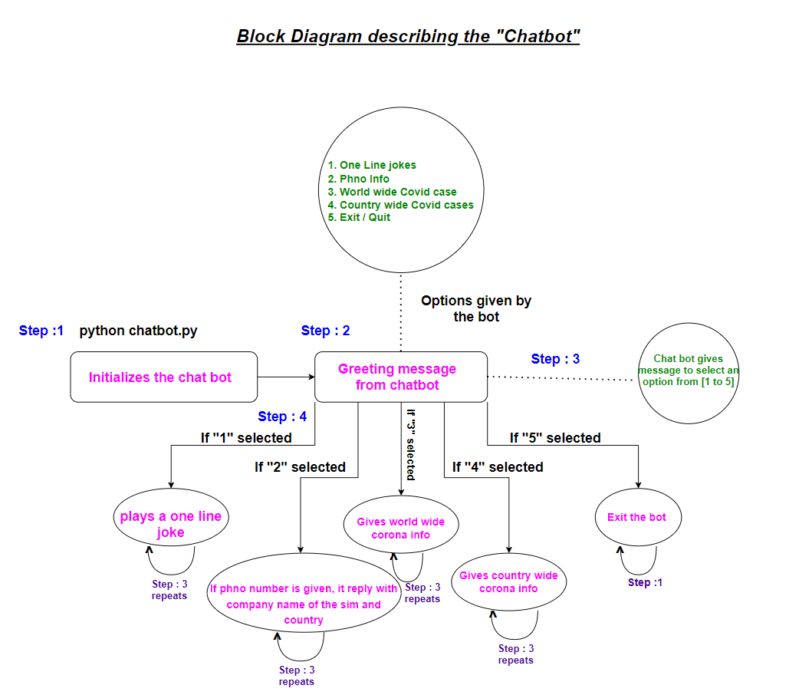

# ML2021_Project1

# Documentation on how to use Chatbot

# Tools that I used for this Chatbot
- VSCode for IDE
- Python 3.8

# Block Diagram of this Chatbot

# Demo Video of this Chatbot

**Thank you**
